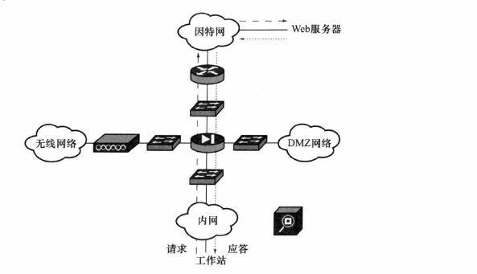
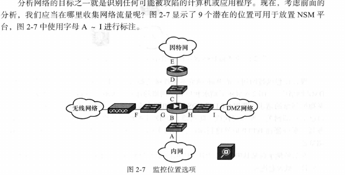
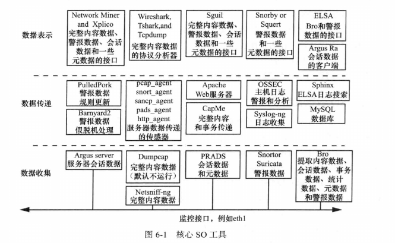
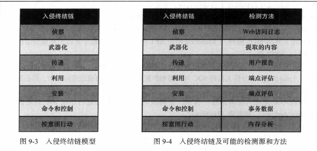
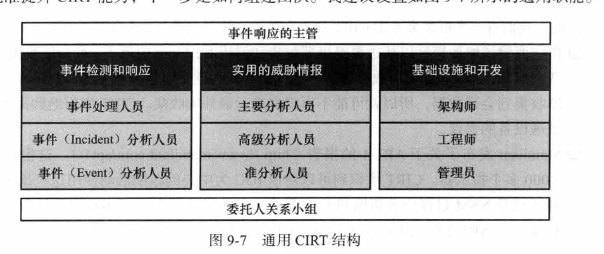

看完总结，主要是针对NSM，即网络安全监控这思想的实现，使用的是开源的组件SO，即security onion. 分别讲了需要哪些数据来实现NSM，优点和缺点，所需要的系统配置，收集的数据保存，配置的脚本等。

同时提供了两个案例，分别为服务端攻击和客户端攻击， 针对这些案例，详细讲解了SO的使用及其中涉及的一些工具的介绍。

对于做HIDS和NIDS及SOC的平台有一定的启发。
# 提到的工具
- tcpdump
- wireshark
- xplico
- 会话数据工具
  - bro
  - argus
  - sguil
- capinfos
- robtex
- snort
- sericata
- snorby

# 主要工具与思想
- NSM(Network Secure Moniter)
- 端口镜像
- 
# 第一部分: 准备开始

## 第一章
1. 完整数据
2. 提取数据
3. 会话数据， 两个网络节点之间的会话记录（）bro
4. 事务数据，类似于nginx日志
5. 统计数据
6. 元数据
7. 警报数据，IDS是报警数据的一个来源，snort, suricata为工具

要点:
在技术，法律，政策等允许的条件下，使用网络为中心的数据检测和响应入侵，
收集，分析并增加尽可能多的证据，

缺点:
1. 对于加密数据无法解析
2. 使用NAT技术会导致源IP错误
3. 流量过大无法处理
4. 隐私问题

NSM是一种依赖于人和方法的行为，
- NSM维基百科(http://nsmwiki.org)
- Security Onion网站
- twiiter成员
- 书中其他参考

## 第二章 收集网络流量: 访问，存储和管理
- 网络流(network traffic flow)

- NSM在网络拓朴中可能出现的位置

- 收集流量的方式
  - 端口镜像
  - 窃听器
  - 直接在客户端或者服务器上捕获流量
  - 考虑NAT， PAT等对源IP获取造成的影响 

- NSM平台
  - 大量的硬盘空间
  - RAM至少4G
  - 多网络接口

- 管理建议
  - 系统SHELL分配管理
  - 管理员不共享root帐号，也不以root帐号登录
  - 使用openssh等安全信道管理传感器
  - 限制传感器上的服务暴露面
  - 日志备份
  - 私有网络中

# 第二部分SO部署
## 单机的NSM部署与安装

## 分布式部署
- SO服务器操作一个中心MySQL数据库
- SO传感器会将pcap数据传递到SO服务器
- 使用.iso安装服务器，传感器
- 使用PPA创建服务器，传感器

## SO平台的日常管理
### 更新
- GUI更新
- 终端更新

### 限制对SO的访问
- 默认有iptables
- ufw(uncomplicated firewall):`sudo ufw allow 9876/tcp`

### 管理SO数据存储
- `/nsm`目录存储日志和完整数据内容， 存储`pcap`格式文件
- `/var/lib/mysql`存储SO数据库
- 管理传感器存储
  - SO脚本会定期检测，90%的阈值
- 检测数据库驱动器的使用
  - SQL语句
- 管理Sguil数据库，配置文件在`/etc/nsm/securityonion.conf`
- 跟踪磁盘使用

# 第三部分 工具
## 命令行下的数据包分析工具
- SO数据表示工具
  - Tshark, Tcpdump
- SO数据收集工具
  - Argus, Netsniff-ng, PRADS, Snort, Suricata, Bro
- SO数据传送工具
  - PulledPort, CapMe, Sguil

### TCPDUMP
- 过滤器
  - host ip
  - src host ip
  - dst host ip
  - filter and filter
- 详细
  - -tttt显示为非时间戳
  - -XX显示以十六进制和ASCII数据

### Dumppcap 和 Tshark
均属于wireshark套件

### Argus和Ra客户端

## 图形化数据包分析工具
### Wireshark
### Xplico
### NetworkMiner

## NSM控制台
### Sguil
### Squert WEB接口
### Snorby WEB接口
### ELSA

# 第四部分: HSM实践
## NSM操作
- 收集
    - 技术过程: 从端点到主机，网络和日志收集数据
      - 创建应用程序数据的日志源
      - 接受和存储数据的日志收集器
      - 将日志从源端移到收集器的传输方法 
    - 非技术过程： 包括来自第三方和委托人的输入记录
    
- 分析：识别和验证正常，可疑和恶意活动的过程
  - 匹配IOC
  - IOC-free analysis，即搜索（hunting）
  - 入侵和事件
    - 入侵事件等级分类:https://taosecurity.blogspot.com/2009/06/extending-information-security-incident.html
    - 事件分类: SIEM(安全信息和事件管理)， 统计和分类事件是任何CIRT必须收集的两个关键度量指标之一。 事件要有内部一致性，
- 升级：记录发现，告知委托人，接收来自委托人的事件报告确认
  - 事件的文档化
    - VERIS(https://www.veris.com/)
  - 事件通知: **需要资产收集，定位**
    - 防御性网络架构:  https://taosecurity.blogspot.com/2008/01/defensible-network-architecture-20.html
      - 受监控
      - 目录化
      - 受控制
      - 断言
      - 最小化
      - 可评估
      - 现关
      - 可度量
  - 事件交流考虑因素
    - VOIP/EMAIL
- 解决:解决事件, 从被攻陷的状态至可靠 状态
  - 牵制方法
    - 关机
    - 断网
    - 防火墙
    - 蜜罐
  - 牵制速度：只要发现，尽快牵制
    - 方案
      - 以威胁为中心：聚焦于假定对手的性质， 通过IOC追踪组织，识别牲
      - 以资产为中心：聚焦于假定的受害计算机的性质， 生产环境，办公电脑等
    - 制定**playboots**
    - 记录事件时间线

### 补救
> 在完全审查事件后，需要重建所有已知与入侵者交互的系统。交互意味着有取证的理由

- 使用NSM改进安全
  - mandiant API1的报告，包含了3000多个IOC
  - NAC（网络访问控制）
- 创建CIRT
  - 跟踪关键度量标准
    - 事件的分类和总数
    - 从发现事件到牵制事件所用的时间（MTTD， MTTR）
  - CIRT的结构
    - 

## 服务端攻击
定义: 通过远程攻击暴露在网上的应用程序，WEB，FTP，DB，其他端口等。
常用的攻击模式：

## 客户端攻击
- 钓鱼邮件
- 访问网站
- 社交媒体交互
## 扩展SO
> 基本上是基于bro插件的扩展

- 使用Bro跟踪可执行文件， 在notice.log中
- 使用Bro从流量中提取二进制程序
- 使用APT1情况 
- 报告恶意二进制程序的下载：MHR（team-cymru.org/About）
## 代理和校验和
代理的出现，可能导致NSM无法获取正确的请求包，
而同样可能在bro的日志中，出现IP校验和不对的情况，可以配置bro忽略这些`-C`
## 总论
- 在云计算的环境下，代替服务为`Threat Stack`
- `Packetloop`用于分析用户上传的流量
- 工作流，度量和协作
  - `CloudShark`

