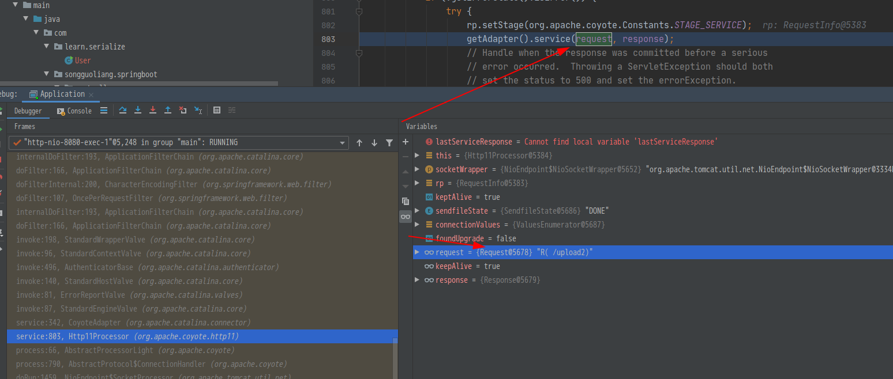
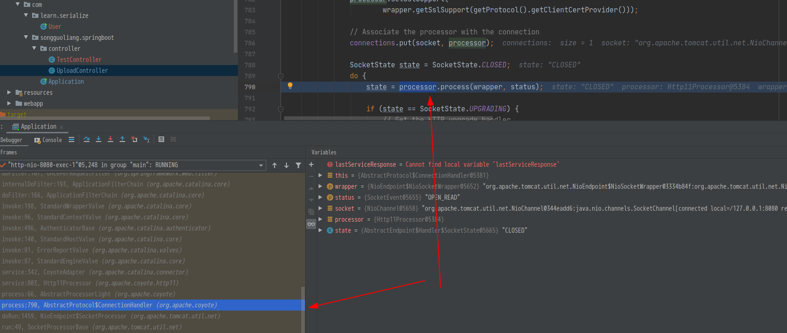
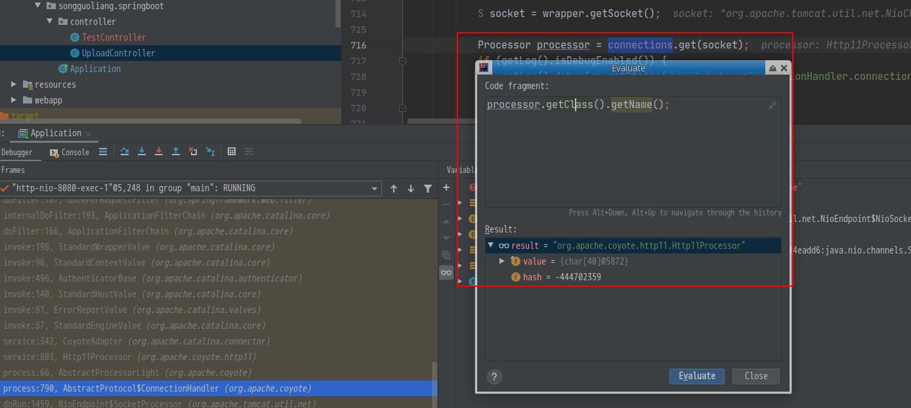
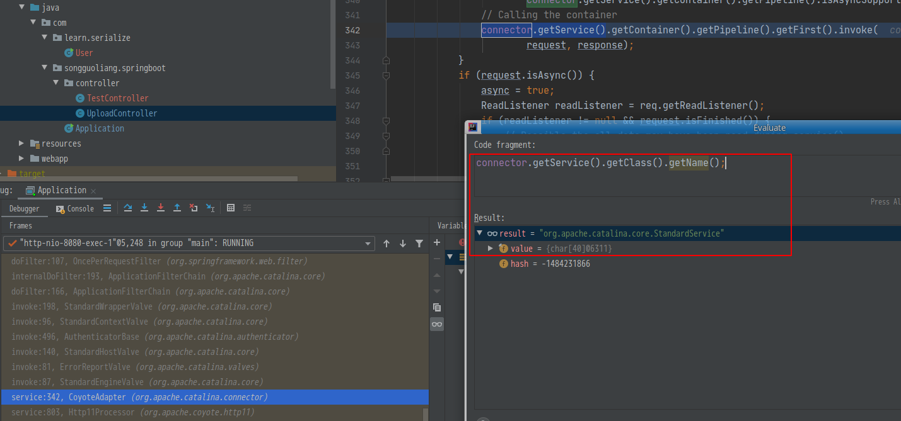
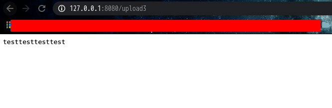

# 环境搭建
> 因为`springboot`的项目自带`tomcat`，所以使用的是`spring`项目. 其他的环境需要自己来配置了

1. `git clone https://github.com/itinypocket/spring-boot-study.git` 
2. 这里随便挑了`spring-boot-upload`
3. 在`UploadController`里添加一个函数
    ```java
    @GetMapping("/upload2")
    public String upload2() {
        String string = "123123";
        return "upload";
    }
    ```
4. 断点打在`String string="123123";` 这一行上
5. `Debug`模式运行
断点如下
<!--  -->

可以看到中间有一部分是`doFilter`的函数, 这里即是在处理`request`时加载的`filter`, 通过`tomcat`注册无文件的`webshell`即对这里操刀.  不过这不是今天的重点

# 第一种方法

## 跟踪`request`
通过网上的文章及参考文章的描述, 知道了需要找到`request`的位置, 并调用其中的`request.getReponse()`获取输出流. 所以就返回去, 看看能否的到第一个`request`是在哪里产生的.
在 **`Http11Processor.java`**中，看到了
```java
    rp.setStage(org.apache.coyote.Constants.STAGE_SERVICE);
    getAdapter().service(request, response);
```
<!--  -->

而并没有类中发现`request`对象, 那么继续去其父类`AbstractProcessor`找:
```java
//AbstractProcessor.java
public abstract class AbstractProcessor extends AbstractProcessorLight implements ActionHook {

    private static final StringManager sm = StringManager.getManager(AbstractProcessor.class);

    protected Adapter adapter;
    protected final AsyncStateMachine asyncStateMachine;
    private volatile long asyncTimeout = -1;
    protected final AbstractEndpoint<?> endpoint;
    protected final Request request;
    protected final Response response;
    protected volatile SocketWrapperBase<?> socketWrapper = null;
    protected volatile SSLSupport sslSupport;
```

可以看到`request`作为其中的变量进行了声明. 并和上述`Http11Processor.java`中为同一个变量
而此时的`request`对象为`org.apache.coyote.Request` 但是这时由于用了`final`变量, 导致不可修改,

继续向上追踪变量, 在`CoyoteAdapter`文件中, 发现了另外一个`request`对象, 此时为`org.apache.catalina.connector.Request`
```java
//CoyotAdapter.java CoyotAdapter#service
public void service(org.apache.coyote.Request req, org.apache.coyote.Response res)
        throws Exception {

    Request request = (Request) req.getNote(ADAPTER_NOTES);
    Response response = (Response) res.getNote(ADAPTER_NOTES);
    if (request == null) {
        // Create objects
        request = connector.createRequest();
        request.setCoyoteRequest(req);
        response = connector.createResponse();
        response.setCoyoteResponse(res);
    ...
    connector.getService().getContainer().getPipeline().getFirst().invoke(
            request, response);

```
由上述我们知道, `org.apache.catalina.connector.Request`是由 `org.apache.coyote.Request` 对象调用`getNode(ADAPTER_NOTES)`生成, 而 `ADAPTER_NOTES`=`1`; 并且可以看到, 如果传递进来的`org.apache.coyote.Request`调用`getNode(1)`返回`null`, 那么`connector.createRequest()`会生成一个新的; 

也就是说, 我们可以获取到 `AbstractProcessor`后, 就可以获取到 `org.apache.coyote.Request`, 调用其 `getNode(1)`返回 `org.apache.catalina.connector.Request`, 继续调用 `request.getResponse()`获取`org.apache.catalina.connector.Response`对象.

## 跟踪`AbstractProcessor`
于是现在的问题是, 如何获取`AbstractProcessor`
由`AbstractProcessor`类的定义可看到, 此类为一个抽像类, 继续查看其父类`AbstractProcessorLight`
```java
public abstract class AbstractProcessor extends AbstractProcessorLight implements ActionHook 
```
`AbstractProcessorLight`的定义如下, 同样是一个抽像类, 继承了接口`Processor`

```java
public abstract class AbstractProcessorLight implements Processor {
```
在往下调用, 发现进入了 `AbstractProtocol$ConnectionHandler`类
<!--  -->

在这里往上, 可以找到 `processor`的创建
<!--  -->

也就是说, `processor`对象由 `connections.get(socket)`返回
但是最开始的时候, 如果`connections`里没有`socket`呢
## 跟踪 `connections`
于是问题变成了找到`connections`
```java
// ConnectionHandler
protected static class ConnectionHandler<S> implements AbstractEndpoint.Handler<S> {

    private final AbstractProtocol<S> proto;
    private final RequestGroupInfo global = new RequestGroupInfo();
    private final AtomicLong registerCount = new AtomicLong(0);
    private final Map<S,Processor> connections = new ConcurrentHashMap<>();
```
可见`connector`为`ConcurrentHashMap`对象,并且是一个`private`变量.  这也就说明了, 我们如果可以定位到`ConnectionHandler`这个类的实例,也就可以获取其 `connections`对象, 继而获取 `Processor`类的实例, 继继而获取`org.apache.coyote.Request`

在这里卡了好久, 不知道如何找到这个类, 于是回头读参考文章,  发现又回到了`CoyoteAdapter.connector`变量
该变量有一个方法为`getProtocol`, 于是进入`Connector`类

```java
public Connector(String protocol) {
    setProtocol(protocol);
    // Instantiate protocol handler
    ProtocolHandler p = null;
    try {
        Class<?> clazz = Class.forName(protocolHandlerClassName);
        p = (ProtocolHandler) clazz.getConstructor().newInstance();
    } catch (Exception e) {
        log.error(sm.getString(
                "coyoteConnector.protocolHandlerInstantiationFailed"), e);
    } finally {
        this.protocolHandler = p;
    }

    if (Globals.STRICT_SERVLET_COMPLIANCE) {
        uriCharset = StandardCharsets.ISO_8859_1;
    } else {
        uriCharset = StandardCharsets.UTF_8;
    }
}
```
发现利用反射生成了一个`ProtocolHandler`类, 而该类又是`AbstractProtocol`所继承的接口. 
所以现在的问题又变成了如何获取`Connector`类

## 跟踪`connector`
在断点跟踪到的 `line:342`中，
```java
connector.getService().getContainer().getPipeline().getFirst().invoke(
                        request, response);
```
`connector`调用了一系列的函数, 先看其第一个函数
<!--  -->


进入这个类看一下
```java
    protected Connector connectors[] = new Connector[0];
    ...

    @Override
    public void addConnector(Connector connector) {

        synchronized (connectorsLock) {
            connector.setService(this);
            Connector results[] = new Connector[connectors.length + 1];

```
可见, `StandardService`有一个`Connector`的数组对象,并且每次创建时,都会将自身作为`connector`的一个参数设置上. 于是问题又变成如何获取`StandardService` 对象了
这里参数文章中提到了, 可以通过`Thread.getCurrentThread().getContextClassLoader()`来获取

## 总结
通过以下调用链, 可以获取到输出
```java
Thread.getCurrentThread().getContextClassLoader() -> 
    StandardService ->
        Connector#getProtocolHandler ->
            connections.value() ->
                request.nodes[1] ->
                    request
```


## 测试
以下的`PoC`, 仅在
- 系统环境为:`linux`
- jdk版本为：`java 1.8.0_252`
- `tomcat`版本: `8.5.29` 

下测试成功,不保证通用性。
仅作为学习调试用, 如果想使用通用的, 可以考虑下边两个参考的文章给出的`PoC`
```java
    @GetMapping("/upload3")
    public String upload3() throws IOException, NoSuchFieldException, IllegalAccessException, NoSuchMethodException, InvocationTargetException {
        String string = "1231231";
        Field contextField = StandardContext.class.getDeclaredField("context");
        Field serviceField = ApplicationContext.class.getDeclaredField("service");
        // 因为在AbstractHttp11Protocol类中，没有getHandler接口, 所以要调用父类的函数
        Method getHandlerMethod = AbstractProtocol.class.getDeclaredMethod("getHandler", null);
        contextField.setAccessible(true);
        serviceField.setAccessible(true);
        getHandlerMethod.setAccessible(true);
        WebappClassLoaderBase webappClassLoaderBase =
                (WebappClassLoaderBase) Thread.currentThread().getContextClassLoader();
        ApplicationContext applicationContext = (ApplicationContext) contextField.get(webappClassLoaderBase.getResources().getContext());
        StandardService standardService = (StandardService) serviceField.get(applicationContext);
        Connector[] connectors = standardService.findConnectors();
        for (int i = 0; i < connectors.length; i++) {
            if (4 == connectors[i].getScheme().length()) {
                ProtocolHandler protocolHandler = connectors[i].getProtocolHandler();
                if (protocolHandler instanceof AbstractHttp11Protocol) {
                    Class[] classes = AbstractProtocol.class.getDeclaredClasses();
                    for (int j = 0; j < classes.length; j++) {
                        if (52 == (classes[j].getName().length()) || 60 == (classes[j].getName().length())) {
                            System.out.println(classes[j].getName());
                            Object object = getHandlerMethod.invoke(protocolHandler, null);
//                            Object object = ((Http11NioProtocol) protocolHandler).getHandler();
                            Field field = object.getClass().getDeclaredField("connections");
                            field.setAccessible(true);
                            ConcurrentHashMap concurrentHashMap = (ConcurrentHashMap) field.get(object);
                            for (Object processor : concurrentHashMap.values()) {
                                org.apache.coyote.Request request = ((Processor) processor).getRequest();
                                Request request1 = (Request) request.getNote(1);
                                String output = "testtesttesttest";
                                Writer writer = request1.getResponse().getWriter();
                                System.out.println(request1.getResponse().getClass().getName());
                                Field usingWriter = request1.getResponse().getClass().getDeclaredField("usingWriter");
                                usingWriter.setAccessible(true);
                                usingWriter.set(request1.getResponse(), Boolean.FALSE);
                                writer.write(output);
                                writer.flush();
                                break;
                            }
                            break;
                        }
                    }
                }
            }

        }
        return "123123";
    }

```
<!--  -->


# 参考:
- [Tomcat通用回显学习](https://lucifaer.com/2020/05/12/Tomcat%E9%80%9A%E7%94%A8%E5%9B%9E%E6%98%BE%E5%AD%A6%E4%B9%A0/)
- [深入了解Tomcat的系统架构](https://zhuanlan.zhihu.com/p/39420883)
- [ysoserial](https://github.com/buptchk/ysoserial/)

# TODO
[Tomcat通用回显学习](https://lucifaer.com/2020/05/12/Tomcat%E9%80%9A%E7%94%A8%E5%9B%9E%E6%98%BE%E5%AD%A6%E4%B9%A0/) 中, 还有一个通过`global`获取`request`,一个`Registry`获取`request`, 后边都要复现一下.