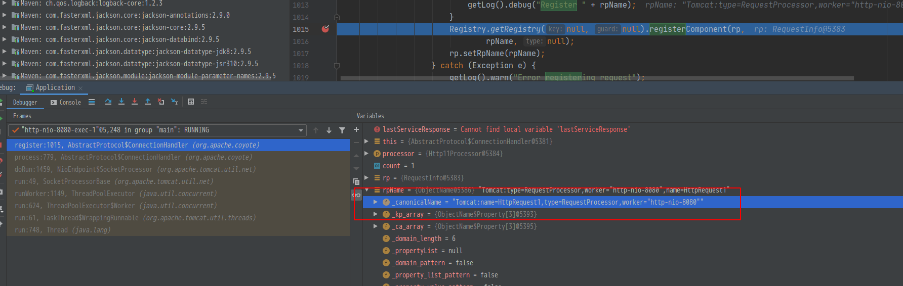
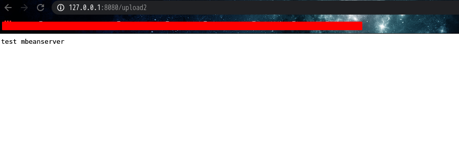

# tomcat通用学习3
> 在 [tomcat通用回显学习2](./tomcat通用回显学习-2.md) 中, 利用了`global`变量, 即`RequestGroupInfo`获取到了`request`
> 同时在该函数`AbstractProtocol$ConnectionHandler`中, 孋如果`processor`不存在, 通过`getPortol().createProcessor()`来创建
> 并调用`register(processor)`进行注册
> 部分`register`函数如下
```java
	long count = registerCount.incrementAndGet();
	RequestInfo rp =
	    processor.getRequest().getRequestProcessor();
	rp.setGlobalProcessor(global);
	ObjectName rpName = new ObjectName(
		getProtocol().getDomain() +
		":type=RequestProcessor,worker="
		+ getProtocol().getName() +
		",name=" + getProtocol().getProtocolName() +
		"Request" + count);
	if (getLog().isDebugEnabled()) {
	    getLog().debug("Register " + rpName);
	}
	Registry.getRegistry(null, null).registerComponent(rp,
		rpName, null);
	rp.setRpName(rpName);
```

在上半部分即2中的利用办法, 将`RequestInfo`注册到`golbal`变量中.  接着往下走, 发现了`registerComponent`函数,
将`rp`变量,也就是类`ObjectName`的某一实例, 注册到一个组件中

## ObjectName
在[Tomcat源码中ObjectName这个类的作用](https://blog.csdn.net/wgw335363240/article/details/6123665) 这篇文章中, 提到了
>  ObjectName 表示一个Mbean的对象名称，或者是表示一个能够匹配几个Mbean的正则，ObjectName 的所有实例都是不可变的。
>  <br>也就是说， ObjectName 类的实例能够用来表示：一个对象名称，或者一个正则对象，这个对象可以通过正则上下文来查询。

在`Registry.getRegistry(null, null)`这里下断点, 可以得到一个`rpName`的实例名: `Tomcat:name=HttpRequest1,type=RequestProcessor,worker="http-nio-8080"`


## Registry
由[Tomcat源码分析-JMX之Registry类（中](https://blog.csdn.net/wojiushiwo945you/java/article/details/73648405)中,
> 用于组装ManagedBean实体，它是构建ManagedBean实体的主要入口。它提供的方法用来创建、操控实体，以及简化他们的使用
> <br>第一，Registry类应用了单例模式，它提供的获取该类实例的方法为getRegistry。

同时, 也可知道`Registry`是用于将`Bean`对象注册到`JMX`的实现
而`JMX`是用于管理和监控`Java`应用的接口规范, 具有以下特点:
1. 通过`JMX`的`MBeans`来读取数据
2. 读取和写入`Mbean`的属性
3. 执行`MBean`的方法

如果可以通过`Registry`获取到`rpName`所在的`Bean`, 即可获取到`rp`对象, 即`RequestInfo`也就是说可以获取到`request`了
在`Registry`类的`registerComponent`函数中, 有注册的详细过程, 可以看到是将`mbean`注册到了`MBeanServer`中,
```java
//Registry#registerComponent
	if( type==null ) {
	type=bean.getClass().getName();
	}

	ManagedBean managed = findManagedBean(null, bean.getClass(), type);

	// The real mbean is created and registered
	DynamicMBean mbean = managed.createMBean(bean);

	if(  getMBeanServer().isRegistered( oname )) {
	if( log.isDebugEnabled()) {
	    log.debug("Unregistering existing component " + oname );
	}
	getMBeanServer().unregisterMBean( oname );
	}

	getMBeanServer().registerMBean( mbean, oname);

```

跟进`getMBeanServer`, 返回了`server`, 在类的声明中: `server`为 `MBeanServer`类

## MBeanServer
`MBeanServer`是一个接口类`public interface MBeanServer extends MBeanServerConnection `
通过`idea`查找一下其实现类, 进入了`JmxMBeanServer`类。

```java
public final class JmxMBeanServer implements SunJmxMBeanServer {
    public static final boolean DEFAULT_FAIR_LOCK_POLICY = true;
    private final MBeanInstantiator instantiator;
    private final SecureClassLoaderRepository secureClr;
    private final boolean interceptorsEnabled;
    private final MBeanServer outerShell;
    private volatile MBeanServer mbsInterceptor;
    private final MBeanServerDelegate mBeanServerDelegateObject;
```

在`JmxMBeanServer`中有重写`queryMBeans`类
```java
    public Set<ObjectInstance> queryMBeans(ObjectName var1, QueryExp var2) {
        return this.mbsInterceptor.queryMBeans(this.cloneObjectName(var1), var2);
    }
```
由定义可以看到, `this.mbsInterceptor` 为 `MBeanServer`类的实例对象
除了`JmxMBeanServer`类, `DefaultMBeanServerInterceptor`也继承了`MBeanServer`
```java
public class DefaultMBeanServerInterceptor implements MBeanServerInterceptor {
    private final transient MBeanInstantiator instantiator;
    private transient MBeanServer server = null;
    private final transient MBeanServerDelegate delegate;
    private final transient Repository repository;
    private final transient WeakHashMap<DefaultMBeanServerInterceptor.ListenerWrapper, WeakReference<DefaultMBeanServerInterceptor.ListenerWrapper>> listenerWrappers = new WeakHashMap();
    private final String domain;
    private final Set<ObjectName> beingUnregistered = new HashSet();

```

其 `queryMBeansImpl`函数
```java
    private Set<ObjectInstance> queryMBeansImpl(ObjectName var1, QueryExp var2) {
        Set var3 = this.repository.query(var1, var2);
        return this.objectInstancesFromFilteredNamedObjects(var3, var2);
    }
```
调用了`repository`的`query`函数

所以到目前为止的流程为:
```
Registry.getRegistry -->
    MBeanServer  -->
        DefaultMBeanServerInterceptor -->
            Repository -->
                RequestInfo -->
                    Request

```

## 测试
```java

    @GetMapping("/upload2")
    public String upload2() throws IOException, NoSuchFieldException, IllegalAccessException, NoSuchMethodException, InvocationTargetException, MalformedObjectNameException {
        String string = "1231231";

        MBeanServer mBeanServer = Registry.getRegistry(null,null).getMBeanServer();
        Field field = mBeanServer.getClass().getDeclaredField("mbsInterceptor");
        field.setAccessible(true);
        Object object = field.get(mBeanServer);
        Field[] fields = object.getClass().getDeclaredFields();
        Field field1 = object.getClass().getDeclaredField("repository");
        field1.setAccessible(true);
        Repository repository = (Repository) field1.get(object);
        System.out.println(repository.getClass().getName());
        //Method[] methods = repository.getClass().getDeclaredMethods();
        Set<NamedObject> query = repository.query(ObjectName.getInstance("Tomcat:name=\"http-nio-8080\",type=GlobalRequestProcessor"), null);
        Iterator iterator = query.iterator();
        while(iterator.hasNext()){
            Object objectName = iterator.next();
            Object requestGroupInfo = ((NamedObject) objectName).getObject();
            Field field2 = requestGroupInfo.getClass().getDeclaredField("resource");
            field2.setAccessible(true);
            RequestGroupInfo requestGroupInfo1 = (RequestGroupInfo) field2.get(requestGroupInfo);
            Field process_field = requestGroupInfo1.getClass().getDeclaredField("processors");
            process_field.setAccessible(true);
            List list = (List) process_field.get(requestGroupInfo1);
            for (int i=0; i<list.size(); i++){
                RequestInfo requestInfo = (RequestInfo) list.get(i);
                Field request_field = requestInfo.getClass().getDeclaredField("req");
                request_field.setAccessible(true);
                Object req_object = request_field.get(requestInfo); //org.apache.coyote.Request
                System.out.println(req_object.getClass().getName());
                org.apache.catalina.connector.Request request_2 = (org.apache.catalina.connector.Request) ((org.apache.coyote.Request) req_object).getNote(1);
                org.apache.catalina.connector.Response response = request_2.getResponse();
                Writer writer = response.getWriter();
                String output = "test";
                java.lang.reflect.Field usingWriter = request_2.getResponse().getClass().getDeclaredField("usingWriter");
                usingWriter.setAccessible(true);
                usingWriter.set(request_2.getResponse(), Boolean.FALSE);
                writer.write(output);
                writer.flush();
                break;
            }
            break;
        }

        return "1234";
    }

```


## 参考
- [你了解JMX在Tomcat的应用吗?](https://www.jianshu.com/p/803d3608c83f)
- [JMX超详细解读](https://www.cnblogs.com/dongguacai/p/5900507.html)
- [Tomcat源码分析-JMX之Registry类](https://blog.csdn.net/wojiushiwo945you/article/details/73648405)
- [Tomcat通用回显学习](https://lucifaer.com/2020/05/12/Tomcat%E9%80%9A%E7%94%A8%E5%9B%9E%E6%98%BE%E5%AD%A6%E4%B9%A0/#2-2-2-%E4%BB%8ERegistry%E4%B8%AD%E8%8E%B7%E5%8F%96)

